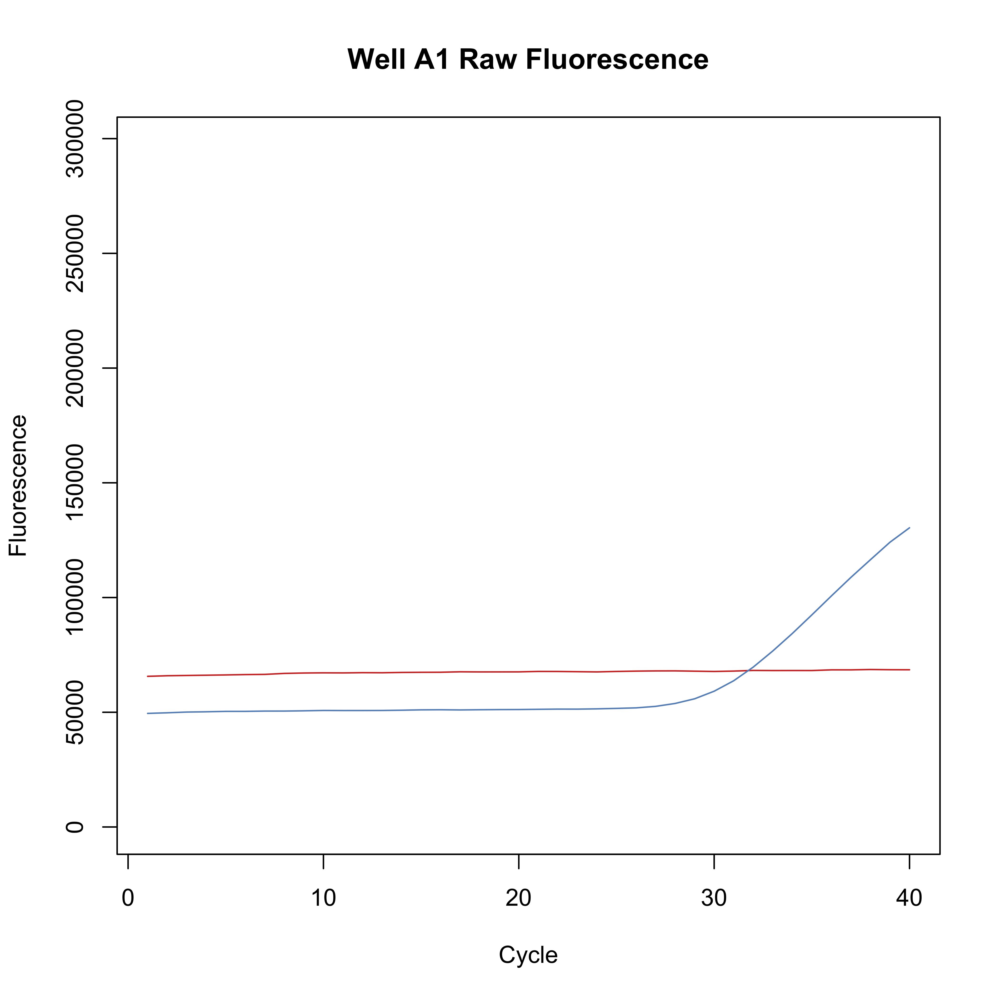
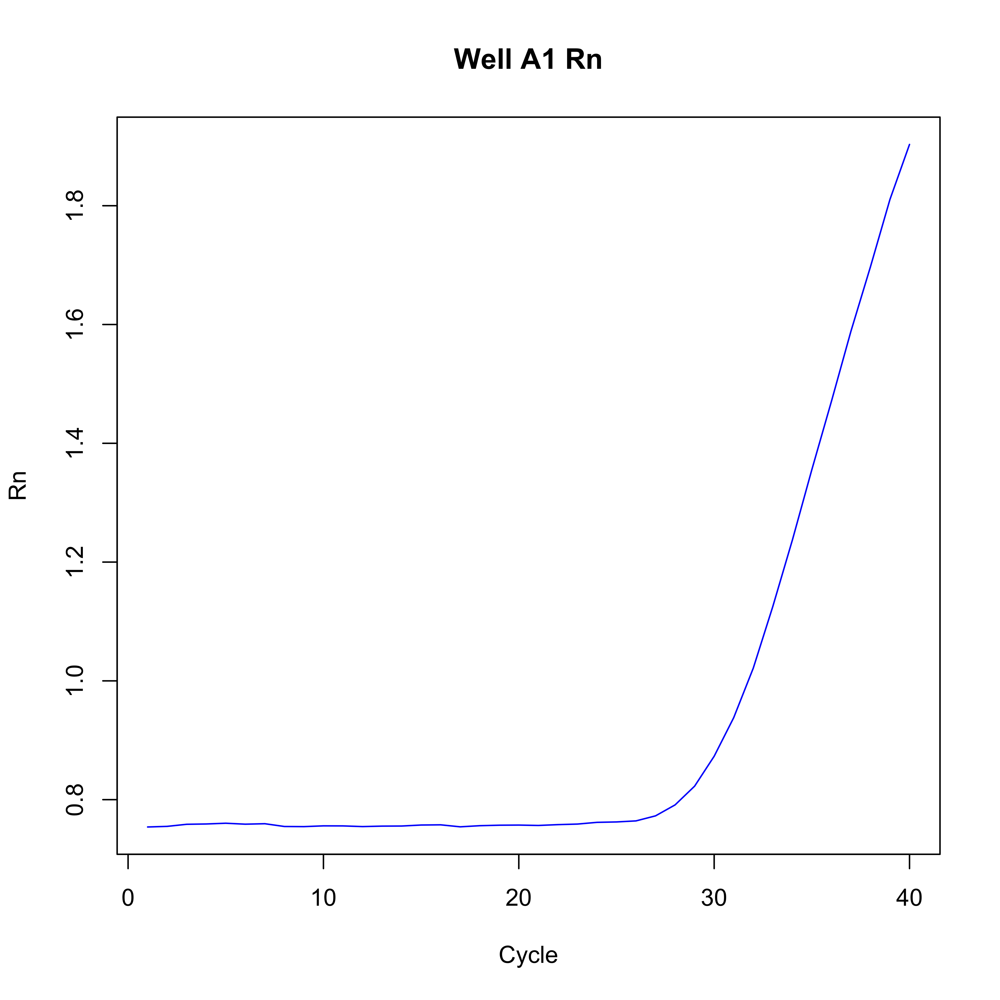
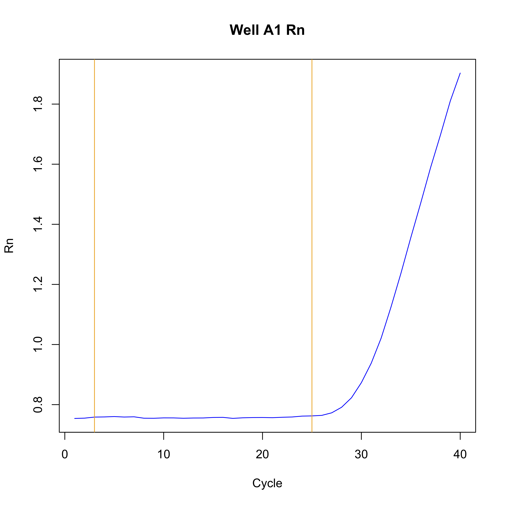
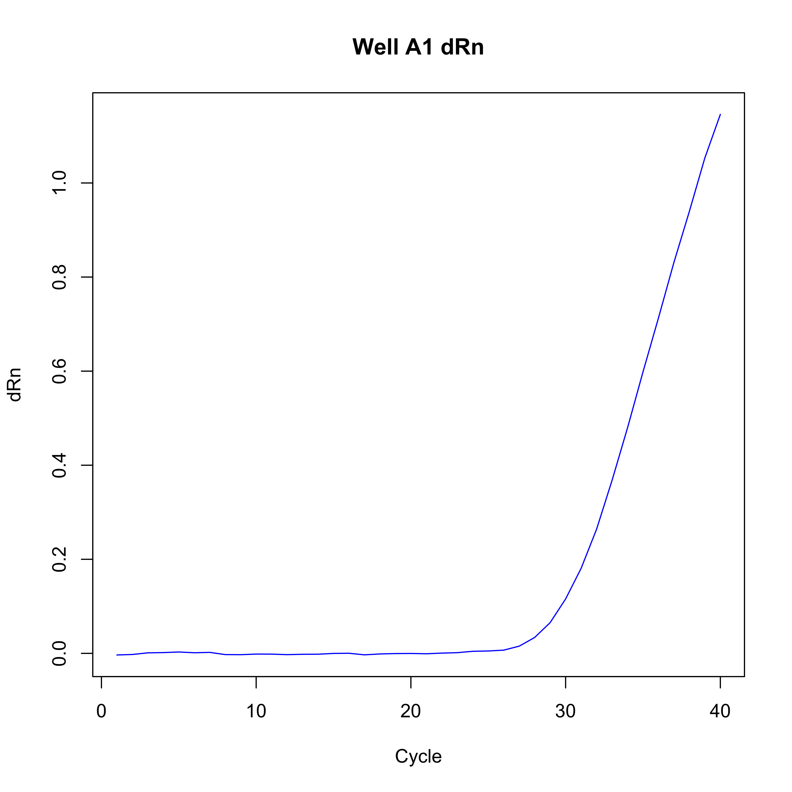
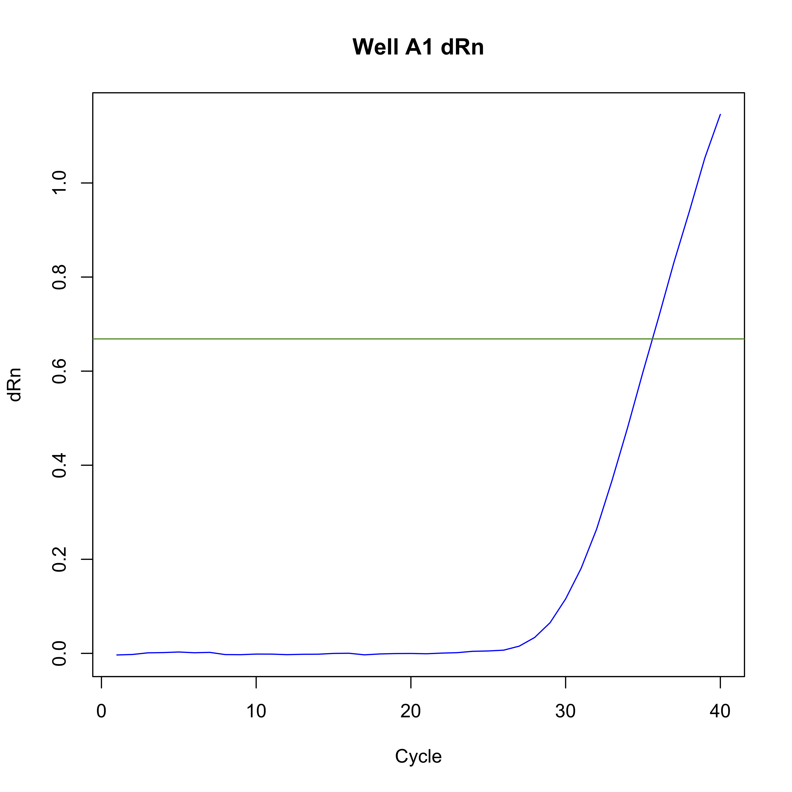
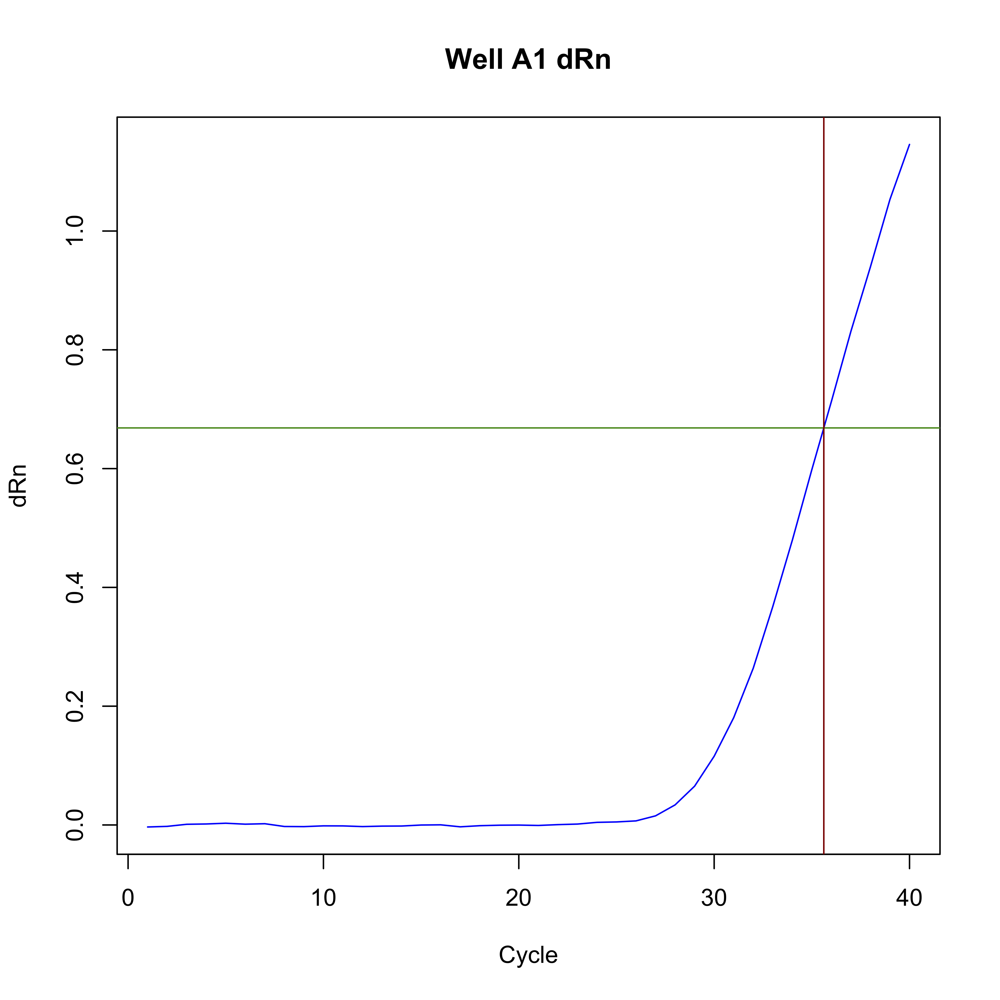

# Example ECMCqPCR Data Processing

This document shows how to use the ECMCqPCR package to process a set of `EDS` files to valid Ct data in R.

## Input Data Format

The `ECMCqPCR` package takes raw FAM and ROX (multicomponent) fluorescence data as input. These data can be extracted from ThermoFisher EDS files (or amplification data from ThermoFisher online) using the [`multicomponent`](https://github.com/alastair-droop/multicomponent) scripts.

The standard multicomponent input files are tab-delimited text files containing four columns: `well <tab> cycle <tab> ROX <tab> FAM`.  For example:

~~~
well	cycle	ROX	FAM
A1	1	65655.87	49503.10
A1	2	65915.59	49767.02
A1	3	66032.81	50087.03
A1	4	66146.13	50208.06
A1	5	66267.91	50383.80
A1	6	66417.96	50391.26
...
~~~

## Standard Analysis Steps

The following commands take a single multicomponent file through to a processed deltaCt matrix for downstream analysis. These commands should be run in R.

### 1: Load the ECMCqPCR Package

Before anything else, we need to ensure that the [`ECMCqPCR package`](https://github.com/alastair-droop/ECMCqPCR) is loaded:

~~~R
library(ECMCqPCR)
~~~

~~~
Loading required package: qpcR
Loading required package: MASS
Loading required package: minpack.lm
Loading required package: rgl
Loading required package: robustbase
Loading required package: Matrix
~~~

### 2: Read in the Multicomponent Data

We can now read in the raw multicomponent data (in this example the input file is names `multicomponent.txt` and the sample name is `S1`):

~~~R
filename <- "multicomponent.txt"
sample.data <- readMulticomponent(filename, sample="S1")
head(sample.data)
~~~

~~~
  card well cycle      ROX      FAM
1   S1   A1     1 65655.87 49503.10
2   S1   A1     2 65915.59 49767.02
3   S1   A1     3 66032.81 50087.03
4   S1   A1     4 66146.13 50208.06
5   S1   A1     5 66267.91 50383.80
6   S1   A1     6 66417.96 50391.26
~~~

### 3: Convert Multicomponent data to Fluorescence

Now that we have the raw FAM and ROX data for each well and cycle, we can make the sample fluorescence data:

~~~R
sample.f <- fluorescence(sample.data, "S1")
~~~

The fluorescence data consists of a list of two matrices (`FAM` and `ROX`), each being the raw fluorescence values for the dyes.

These raw fluorescence values can be plotted (specific wells can be selected using the `wells=` argument):

~~~R
plotFluorescence(sample.f, well="A1")
title(main="Well A1 Raw Fluorescence")
~~~

### 4: Model the well fluorescence behaviour

Before proceeding, we can model the shape of the well fluorescence curves.  This will be used both for filtering invalid data and also for defining the linear portion of each well curve.

~~~R
sample.m <- pcrModel(sample.f$FAM, model=l4)
sample.s <- pcrModelStats(sample.m)
~~~

### 5: Generate the Rn Matrix

The sample Rn matrix is calculated as:

~~~R
sample.rn <- calculateRn(sample.f)
~~~

As with the raw fluorescence curves, the Rn data can be plotted:

~~~R
plotRn(sample.rn, wells="A1")
title(main="Well A1 Rn")
~~~

### 6: Determine the Well Baseline

Before calculating the Cn data, we need to determine the endpoints of the flat phase of well curves (i.e. the well *baseline*). A sensible default value would be the cycle range [3, 15], but we can attempt to model the baseline from the fitted well models:

~~~R
sample.baseline.end <- pcrModelFlatPhaseEnd(sample.m, min=5, default=15)
sample.baseline <- calculateBaseline(sample.rn, start=3, end=sample.baseline.end)
~~~

We can check what this has done by plotting it on the well Rn data:

~~~R
plotRn(sample.rn, wells="A1")
title(main="Well A1 Rn")
abline(v=sample.baseline["A1", c("start", "end")], col="orange")
~~~

### 7: Calculate the Card deltaRn Values

Once we've defined the per-well baselines, we can normalise the sample Rn values to deltaRn:

~~~R
sample.drn <- calculateDeltaRn(sample.rn, sample.baseline)
~~~

Again, this can be plotted:

~~~R
plotRn(sample.drn, well="A1")
title(main="Well A1 dRn")
~~~

### 8: Calculate the Sample Threshold Value

The card threshold value is calculated from the baseline data for all wells on the card. This can be calculated as:

~~~R
sample.threshold <- calculateThreshold(sample.baseline)
~~~

~~~R
plotRn(sample.drn, well="A1")
title(main="Well A1 dRn")
abline(h=sample.threshold, col="green4")
~~~

### 9: Calculate the Sample Ct Values

Once we've calculated the sample threshold value, we can convert the dRn data into Ct:

~~~R
sample.ct <- calculateCt(sample.drn, sample.threshold, start.cycle=15)
~~~

~~~R
plotRn(sample.drn, well="A1")
title(main="Well A1 dRn")
abline(h=sample.threshold, col="green4")
abline(v=sample.ct["A1"], col="red4")
~~~

### 10: Filter Ct Values

There are many different reasons why a calculated Ct value might be invalid.  For example, the input FAM and ROX curves might show invalid shapes, or the calculated Ct value might be too high to be considered useful. We can filter sample Ct values to remove these cases using three functions:

* `filterModelShape`: Filter wells based on modelled curve shape;
* `filterBaseline`: Filter wells on baseline smoothness; and
* `filterCt`: Filter wells based on calculated Ct value.

Each of these functions returns a logical vector, specifying if each well has passed the filter. For example,

~~~R
sample.valid <- data.frame(
    "model" = filterModelShape(sample.s),
    "baseline" = filterBaseline(sample.baseline, threshold=0.025),
    "Ct" = filterCt(sample.ct, min=25, max=36)
)
~~~

After applying indiviual filters, we can selected valid wells that pass all filters:

~~~R
sample.valid$valid <- apply(sample.valid, 1, all)
head(sample.valid)
~~~

~~~
   model baseline    Ct valid
A1  TRUE     TRUE  TRUE  TRUE
A2  TRUE     TRUE FALSE FALSE
A3  TRUE     TRUE  TRUE  TRUE
A4  TRUE     TRUE  TRUE  TRUE
A5  TRUE     TRUE FALSE FALSE
A6  TRUE     TRUE  TRUE  TRUE
~~~
